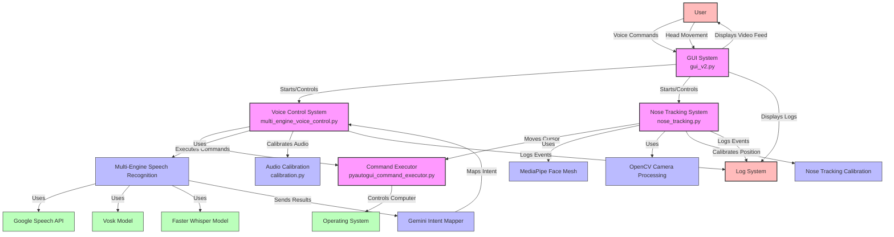
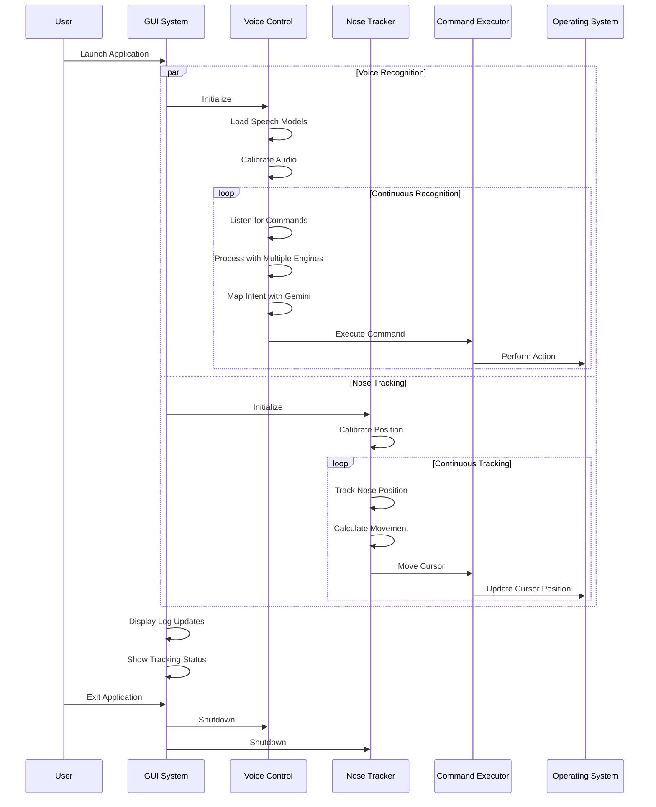
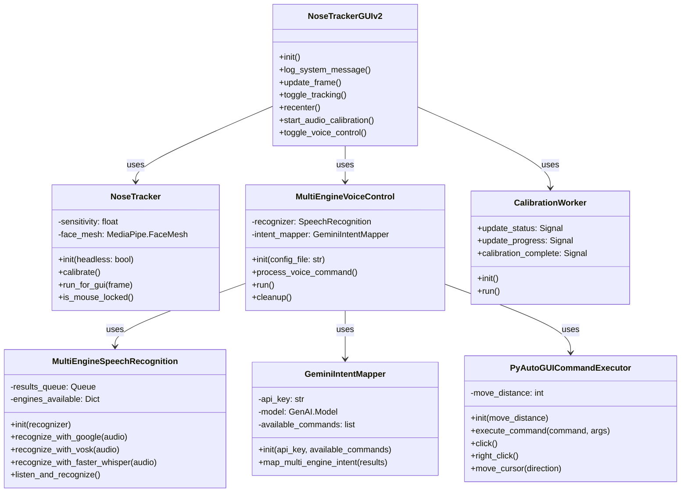

# Voxel System Architecture

## System Overview Diagram

```mermaid
graph TD
    %% Main System Components
    User[User]
    GUI[GUI System<br>gui_v2.py]
    Voice[Voice Control System<br>multi_engine_voice_control.py]
    Nose[Nose Tracking System<br>nose_tracking.py]
    CommandExec[Command Executor<br>pyautogui_command_executor.py]
    System[Operating System]
  
    %% Voice Recognition Components
    VoiceRec[Multi-Engine Speech Recognition]
    GoogleAPI[Google Speech API]
    VoskModel[Vosk Model]
    WhisperModel[Faster Whisper Model]
    GeminiLLM[Gemini Intent Mapper]
  
    %% Nose Tracking Components
    FaceMesh[MediaPipe Face Mesh]
    OpenCV[OpenCV Camera Processing]
  
    %% Calibration Components
    AudioCal[Audio Calibration<br>calibration.py]
    NoseCal[Nose Tracking Calibration]
  
    %% Log System
    LogSystem[Log System]
  
    %% User Interactions
    User -->|Voice Commands| GUI
    User -->|Head Movement| GUI
  
    %% Main Component Interactions
    GUI -->|Displays Video Feed| User
    GUI -->|Starts/Controls| Voice
    GUI -->|Starts/Controls| Nose
    Voice -->|Executes Commands| CommandExec
    Nose -->|Moves Cursor| CommandExec
    CommandExec -->|Controls Computer| System
  
    %% Voice Component Breakdown
    Voice -->|Uses| VoiceRec
    VoiceRec -->|Uses| GoogleAPI
    VoiceRec -->|Uses| VoskModel
    VoiceRec -->|Uses| WhisperModel
    VoiceRec -->|Sends Results| GeminiLLM
    GeminiLLM -->|Maps Intent| Voice
    Voice -->|Calibrates Audio| AudioCal
  
    %% Nose Tracking Breakdown
    Nose -->|Uses| FaceMesh
    Nose -->|Uses| OpenCV
    Nose -->|Calibrates Position| NoseCal
  
    %% Logging
    Voice -->|Logs Events| LogSystem
    Nose -->|Logs Events| LogSystem
    GUI -->|Displays Logs| LogSystem
  
    %% Styling
    classDef main fill:#f9f,stroke:#333,stroke-width:2px;
    classDef subsystem fill:#bbf,stroke:#333,stroke-width:1px;
    classDef integration fill:#bfb,stroke:#333,stroke-width:1px;
    classDef user fill:#fbb,stroke:#333,stroke-width:2px;
  
    class GUI,Voice,Nose,CommandExec main;
    class VoiceRec,GeminiLLM,FaceMesh,OpenCV,AudioCal,NoseCal subsystem;
    class GoogleAPI,VoskModel,WhisperModel,System integration;
    class User,LogSystem user;
```

## Data Flow Diagram

```mermaid
sequenceDiagram
    participant User
    participant GUI as GUI System
    participant Voice as Voice Control
    participant Nose as Nose Tracker
    participant Exec as Command Executor
    participant System as Operating System
  
    User->>GUI: Launch Application
  
    par Voice Recognition
        GUI->>Voice: Initialize
        Voice->>Voice: Load Speech Models
        Voice->>Voice: Calibrate Audio
        loop Continuous Recognition
            Voice->>Voice: Listen for Commands
            Voice->>Voice: Process with Multiple Engines
            Voice->>Voice: Map Intent with Gemini
            Voice->>Exec: Execute Command
            Exec->>System: Perform Action
        end
    and Nose Tracking
        GUI->>Nose: Initialize
        Nose->>Nose: Calibrate Position
        loop Continuous Tracking
            Nose->>Nose: Track Nose Position
            Nose->>Nose: Calculate Movement
            Nose->>Exec: Move Cursor
            Exec->>System: Update Cursor Position
        end
    end
  
    GUI->>GUI: Display Log Updates
    GUI->>GUI: Show Tracking Status
  
    User->>GUI: Exit Application
    GUI->>Voice: Shutdown
    GUI->>Nose: Shutdown
```

## Component Architecture

```mermaid
classDiagram
    class NoseTrackerGUIv2 {
        +init()
        +log_system_message()
        +update_frame()
        +toggle_tracking()
        +recenter()
        +start_audio_calibration()
        +toggle_voice_control()
    }
  
    class NoseTracker {
        -sensitivity: float
        -face_mesh: MediaPipe.FaceMesh
        +init(headless: bool)
        +calibrate()
        +run_for_gui(frame)
        +is_mouse_locked()
    }
  
    class MultiEngineVoiceControl {
        -recognizer: SpeechRecognition
        -intent_mapper: GeminiIntentMapper
        +init(config_file: str)
        +process_voice_command()
        +run()
        +cleanup()
    }
  
    class MultiEngineSpeechRecognition {
        -results_queue: Queue
        -engines_available: Dict
        +init(recognizer)
        +recognize_with_google(audio)
        +recognize_with_vosk(audio)
        +recognize_with_faster_whisper(audio)
        +listen_and_recognize()
    }
  
    class GeminiIntentMapper {
        -api_key: str
        -model: GenAI.Model
        -available_commands: list
        +init(api_key, available_commands)
        +map_multi_engine_intent(results)
    }
  
    class PyAutoGUICommandExecutor {
        -move_distance: int
        +init(move_distance)
        +execute_command(command, args)
        +click()
        +right_click()
        +move_cursor(direction)
    }
  
    class CalibrationWorker {
        +update_status: Signal
        +update_progress: Signal
        +calibration_complete: Signal
        +init()
        +run()
    }
  
    NoseTrackerGUIv2 --> NoseTracker : uses
    NoseTrackerGUIv2 --> MultiEngineVoiceControl : uses
    NoseTrackerGUIv2 --> CalibrationWorker : uses
    MultiEngineVoiceControl --> MultiEngineSpeechRecognition : uses
    MultiEngineVoiceControl --> GeminiIntentMapper : uses
    MultiEngineVoiceControl --> PyAutoGUICommandExecutor : uses
```
